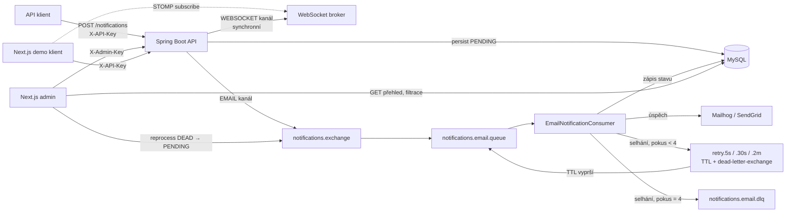

# Notification Center

Multi-channel notification microservice (e-mail, in-app přes WebSocket) postavený
na Spring Boot + RabbitMQ + MySQL. Klient pošle notifikaci přes REST API,
systém ji spolehlivě doručí — s retry, dead-letter frontou a pluggable
architekturou kanálů — a poskytuje admin panel a demo appku pro živou ukázku.

Portfolio projekt: cíl není generický CRUD tutoriál, ale demonstrace návrhu
produkčního backendu — queue-based zpracování, spolehlivé doručení, čitelné
architektonické rozhodnutí místo copy-paste řešení.

## Architektura



## Klíčová rozhodnutí

**RabbitMQ, ne Kafka.** Objem zpráv v tomhle rozsahu (jednotky až stovky
notifikací/s) nepotřebuje Kafkovu propustnost ani log-based replay. RabbitMQ
dá zadarmo přesně to, co je tu potřeba: routing přes exchange/queue, TTL +
dead-letter-exchange pro retry bez extra pluginu, a management UI pro
debugging. Kafka by přidala operační komplexitu (partitions, consumer
groups, offset management) bez odpovídajícího přínosu — má smysl až při
řádově vyšším objemu nebo potřebě event replay/log compaction napříč
konzumenty (viz roadmapa níže).

**Retry bez pluginu: TTL + dead-letter-exchange.** RabbitMQ nemá nativní
zpožděné doručení. Místo instalace `rabbitmq-delayed-message-exchange`
pluginu (extra závislost na image) se retry řeší třemi frontami s TTL
(5s/30s/2min), z nichž každá po vypršení TTL dead-letteruje zprávu zpátky do
hlavní fronty přes výchozí exchange. Počet pokusů se počítá z existujících
`delivery_attempt` řádků v DB, ne z RabbitMQ `x-death` hlavičky — nezávislé
na broker-specific mechanismu, čitelnější pro debugging.

**Pluggable kanály, ne switch/if.** `NotificationChannelHandler` interface
(`channel()` + `dispatch()`) s jednou implementací per kanál. `NotificationService`
si všechny implementace posbírá přes `List<NotificationChannelHandler>` a
postaví `Map<NotificationChannel, _>` — přidání nového kanálu (SMS, push) je
nová `@Component` třída, beze změny existujícího kódu. EMAIL a WEBSOCKET mají
záměrně různou doručovací charakteristiku: EMAIL jde přes RabbitMQ s retry/DLQ
(asynchronní, může trvat), WEBSOCKET je synchronní bez retry (live push buď
doručí hned, nebo klient zprávu propásne — opožděný retry pro in-app
notifikaci nedává smysl).

**In-memory rate limiting, ne Redis.** Token bucket (Bucket4j) per klient v
paměti jedné instance. Appka běží jako jedna instance bez horizontálního
škálování — sdílený stav napříč instancemi není potřeba a Redis jako
infrastruktura navíc by byl pro tenhle rozsah overkill. Až (a pokud) by šlo o
víc instancí za load balancerem, limit by bylo potřeba přesunout do Redis
(Bucket4j na to má drop-in rozšíření) — jinak by každá instance počítala
limit nezávisle a efektivní limit by byl N × nastavený.

**SendGrid přes SMTP relay, ne jejich SDK.** Existující `JavaMailSender`/
`MimeMessageHelper` kód funguje beze změny — jen se přepne `spring.mail.*`
konfigurace přes Spring profil (`demo`). Přidání SendGrid Java SDK by
znamenalo psát druhou, SendGrid-specifickou cestu pro odesílání e-mailů
vedle stávající SMTP cesty — zbytečná duplicita pro to, co SMTP relay řeší
jednodušeji.

**Admin autentizace oddělená od klientské.** `X-API-Key` (per klient, SHA-256
hash v DB) škáluje notifikace pod vlastníka-klienta. Admin panel ale musí
vidět napříč všemi klienty, což by tenhle ownership model narušilo — proto
samostatný `X-Admin-Key` (jeden sdílený token z env proměnné). Pro MVP s
jedním adminem dostačující; plnohodnotné uživatelské účty s rolemi by byly
overkill.

## Datový model

- **Client** — `name`, `api_key_hash` (SHA-256, ne plaintext), `active`
- **Notification** — `client_id`, `channel`, `recipient`, `subject`, `body`,
  `status` (`PENDING → SENT` / `PENDING → DEAD`)
- **DeliveryAttempt** — `notification_id`, `attempt_number`, `status`
  (`SUCCESS`/`FAILURE`), `error_message` — historie každého pokusu o doručení
- **NotificationTemplate** — `code`, `channel`, `content` (Thymeleaf HTML,
  placeholdery `${...}`)

## Tech stack

Java 21, Spring Boot 3.5, MySQL 8.4 + Flyway, RabbitMQ 3.13, Thymeleaf,
Bucket4j. Next.js 16 (App Router, Server Components, Server Actions) pro
admin panel a demo klienta, TypeScript, Tailwind CSS 4.

## Spuštění (lokální vývoj)

```bash
docker compose up -d
./mvnw spring-boot:run
```

Po startu:
- API: http://localhost:8080
- Health check: http://localhost:8080/actuator/health
- RabbitMQ management: http://localhost:15672 (guest/guest)
- Mailhog UI (odchozí e-maily): http://localhost:8025

**Pozn.:** MySQL běží lokálně na portu `3307` (ne výchozím `3306`), protože
3306 je na tomto stroji obsazený jiným projektem.

Klienta pro testování API vytvoříš přes admin panel (níže) — bez API klíče
`POST /api/v1/notifications` vrátí 401.

## Admin panel

Next.js admin dashboard v [`admin/`](admin/README.md) — přehled notifikací
s filtrací a historií pokusů o doručení, správa klientů (vytvoření + API
key) a šablon. Vyžaduje běžící backend.

```bash
cd admin
npm install
npm run dev
```

## Demo klient

Next.js ukázková appka v [`demo/`](demo/README.md) — formulář na odeslání
notifikace + live WebSocket feed. Vyžaduje běžící backend a existujícího
klienta (vytvoř přes admin panel).

```bash
cd demo
npm install
npm run dev
```

## Produkční e-mail (SendGrid)

Lokálně se e-maily posílají na Mailhog (nic reálně neodejde). Pro reálné
odeslání přes SendGrid:

1. Založ SendGrid účet, ověř sender identitu pro `ondrecreates@gmail.com`
   (Single Sender Verification), vygeneruj API klíč.
2. Spusť s profilem `demo`:

```bash
SPRING_PROFILES_ACTIVE=demo SENDGRID_API_KEY=<tvůj-klíč> ./mvnw spring-boot:run
```

Nic dalšího se měnit nemusí — `application-demo.yml` přepne jen SMTP
konfiguraci a sender adresu, zbytek (DB, RabbitMQ, admin klíč) zůstává stejný.

## Testy

```bash
./mvnw test
```

Unit testy pokrývají retry stavový automat (`NotificationDeliveryServiceTest`)
a Thymeleaf rendering šablon (`TemplateRenderingServiceTest`). Integrační
test (`NotificationApiIntegrationTest`) ověřuje celý tok `POST /notifications`
→ RabbitMQ → `EmailNotificationConsumer` → skutečně odeslaný e-mail, přes
Testcontainers (MySQL + RabbitMQ) a GreenMail (in-JVM fake SMTP).

**Známé omezení tohoto stroje:** integrační test na tomto konkrétním počítači
selhává kvůli kompatibilitě mezi Docker Desktop 4.80 (Docker Engine API 1.55)
a Testcontainers 1.20.4 — `docker info` vrací přes docker-java klienta
neúplnou odpověď (`BadRequestException`, prázdná těla polí). Standardní
`docker` CLI a `docker compose` fungují bez problémů, jde čistě o
kompatibilitu Testcontainers knihovny s touto verzí Docker Desktop. Test kód
je hotový a projde na stroji s kompatibilní verzí Docker Desktop nebo po
vydání novější Testcontainers verze s podporou API 1.55.

## Roadmapa — co dál

Mimo MVP, vědomě odloženo:

- **SMS (Twilio)** — vyžaduje placený účet, nešlo by to demonstrovat zadarmo
  a defensibilně na portfoliu.
- **Push notifikace (FCM/APNs)** — vyžaduje mobilního klienta, není ho kde
  reálně otestovat v rámci tohoto projektu.
- **Kafka** — až při řádově vyšším objemu zpráv nebo potřebě event replay
  napříč více nezávislými konzumenty; pro současný rozsah by RabbitMQ→Kafka
  migrace přidala komplexitu bez odpovídajícího přínosu (viz "Klíčová
  rozhodnutí" výše).
- **Multi-tenant / white-label** — mimo scope jednoho portfolio projektu.
- **Redis pro rate limiting** — až při horizontálním škálování na víc
  instancí (viz "Klíčová rozhodnutí" výše).
